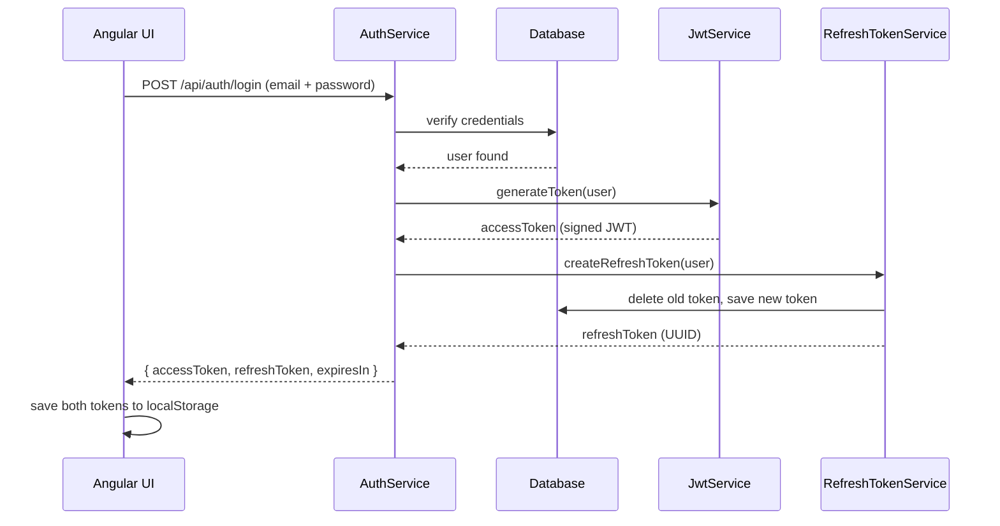
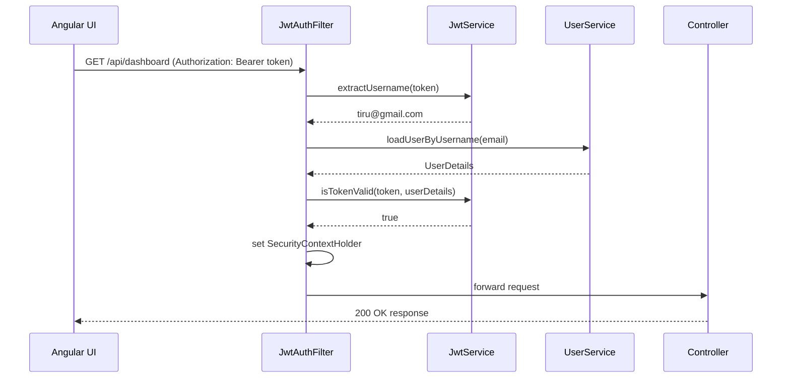
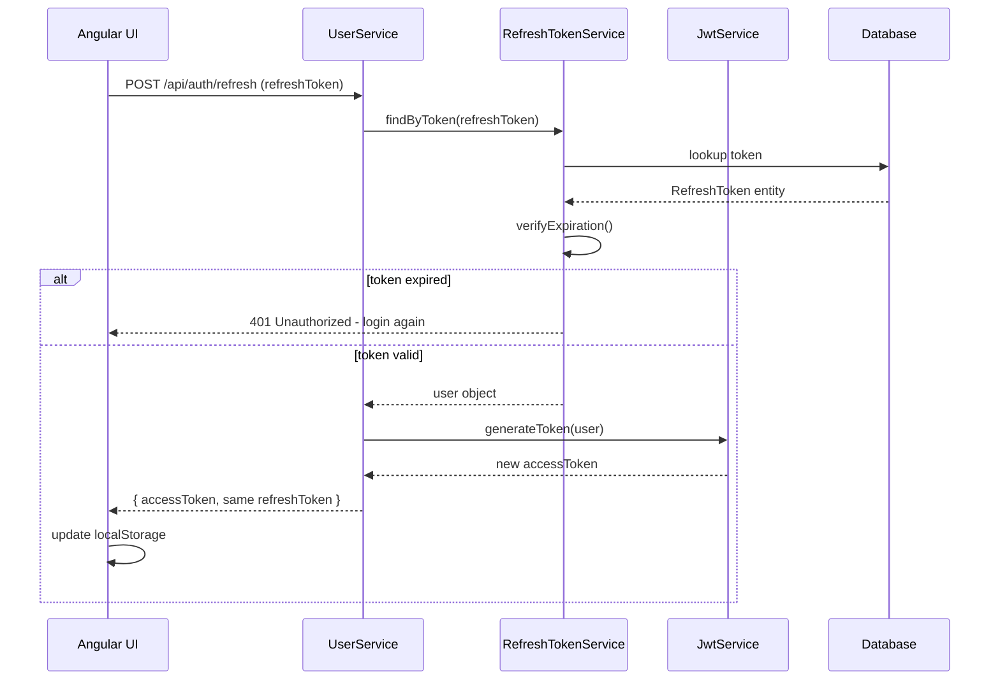

# JWT Fullstack Authentication

Full stack JWT authentication system built with Spring Boot and Angular.

## Author
**Tiru** — [@tiru1245](https://github.com/tiru1245)

## Tech Stack
| Layer | Technology |
|-------|-----------|
| Backend | Java 21, Spring Boot 3, Spring Security 6 |
| Database | MySQL |
| Token | JWT (jjwt), Refresh Token |
| Frontend | Angular 17+, Reactive Forms |

---

## What Problem Does JWT Solve?

Traditional session-based auth stores session in server memory.
If load balancer sends request to a different server — session is lost.

JWT is **stateless** — the token itself contains all the proof.
Any server can validate any token using just the secret key.

---

## JWT Token Structure

```
eyJhbGciOiJIUzI1NiJ9 . eyJzdWIiOiJ0aXJ1QGdtYWlsLmNvbSJ9 . SflKxwRJSMe
       Header                      Payload                      Signature
  (algorithm: HS256)       (email, issued at, expiry)      (HMAC SHA256)
```

> Header and Payload are Base64 encoded — anyone can read them.
> Signature is the proof — only server can verify it using the secret key.

---

## Flow 1 — Login / Register



---

## Flow 2 — Protected API Request



---

## Flow 3 — Refresh Token



---

## Project Structure

```
jwt-fullstack/
├── backend/                         
│   └── src/main/java/com/example/jwt/
│       ├── config/
│       │   ├── SecurityConfig.java       ← Spring Security setup
│       │   ├── CorsConfig.java           ← CORS for Angular
│       │   ├── PasswordConfig.java       ← BCrypt bean
│       │   └── DataInitializer.java      ← seeds admin account
│       ├── filter/
│       │   └── JwtAuthenticationFilter.java  ← validates every request
│       ├── service/
│       │   ├── JwtService.java           ← generate + validate tokens
│       │   ├── AuthService.java          ← login logic
│       │   ├── UserService.java          ← user details + refresh
│       │   └── RefreshTokenService.java  ← refresh token lifecycle
│       ├── dto/
│       │   ├── LoginRequest.java
│       │   ├── RegisterRequest.java
│       │   ├── RefreshTokenRequest.java
│       │   └── AuthResponse.java
│       └── exceptions/
│           ├── GlobalExceptionHandler.java
│           ├── EmailAlreadyExistsException.java
│           ├── TokenExpiredException.java
│           └── TokenNotFoundException.java
│
└── frontend/                        
    └── src/app/
        ├── auth.service.ts           ← HTTP calls + token storage
        ├── login/                    ← login form + validation
        └── register/                 ← register form + validation
```

---

## API Endpoints

| Method | URL | Description | Auth Required |
|--------|-----|-------------|---------------|
| POST | `/api/auth/register` | Register new user | No |
| POST | `/api/auth/login` | Login and get tokens | No |
| POST | `/api/auth/refresh` | Get new access token | No |
| GET | `/api/admin/**` | Admin only routes | ADMIN role |

---

## Setup

### Backend
```bash
# 1. Clone the repo
git clone https://github.com/tiru1245/jwt-fullstack.git
cd jwt-fullstack/backend

# 2. Create MySQL database
mysql -u root -p
CREATE DATABASE jwtdb;

# 3. Configure application.properties
spring.datasource.url=jdbc:mysql://localhost:3306/jwtdb
spring.datasource.username=YOUR_DB_USERNAME
spring.datasource.password=YOUR_DB_PASSWORD
jwt.secret=YOUR_BASE64_SECRET_KEY
jwt.expiration=86400000
jwt.refresh-expiration=604800000
app.admin.email=YOUR_ADMIN_EMAIL
app.admin.password=YOUR_ADMIN_PASSWORD

# 4. Run
mvn spring-boot:run
```

### Frontend
```bash
cd jwt-fullstack/frontend
npm install
ng serve
# open http://localhost:4200
```

---

## Security Notes

- JWT secret key must be Base64 encoded and minimum 256 bits
- Never commit real credentials to GitHub
- Access token is short-lived — limits damage if stolen
- Refresh token is stored in DB — can be revoked server side
- CORS configured to allow only `localhost:4200`
